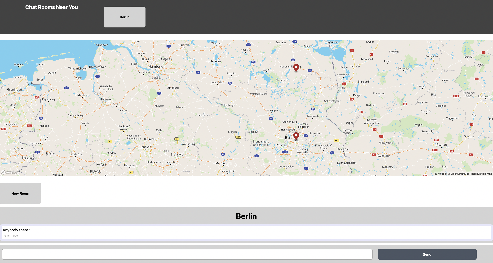

# Location Based Chat

## Description
A location-based chat app with Postgres, NestJS, and React. Utilized mapboxgl and web sockets. Once authenticated, this app allows users to chat with other users within their geographical proximity. Users can create chat rooms at their location and any other user within a specific radius can join. Messages are transient and not stored in a database, but rather emitted to any invidiual currently in the chat room. This means there is no chat histroy for new users in a chat room, and users can only see activity posted during their time in the chat room.

This app is published on the web [here](https://hagenlarsenlocationchat.herokuapp.com/)!

## Build Instructions
Find the build instructions [here](INSTRUCTIONS.md).

## Images

